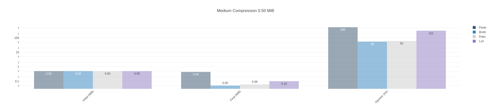
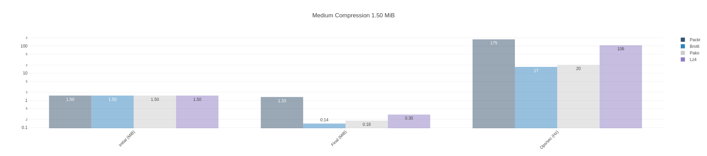
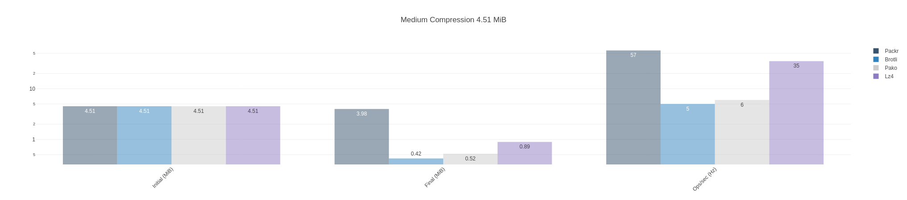
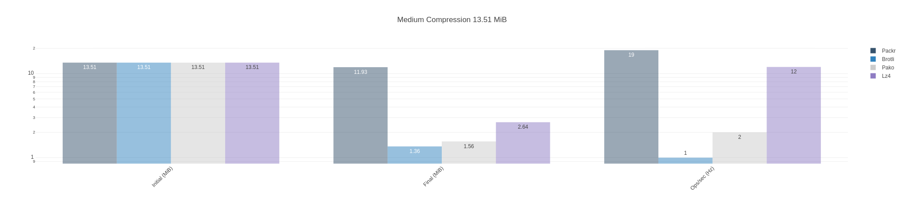

# Metrology Data Compression Nopack Benchmark

Suite of metrology data compression benchmarks based on the [fake metrology data](https://github.com/dstanesc/fake-metrology-data) library.

Quantifying the impact of packing (ie. `msgpackr`) on compression

Currently tested libraries: `msgpackr`, `brotli`, `pako` and `lz4js`.


## Dependencies

```sh
$ node --version
v16.13.1

$ npm --version
8.1.2
```

## Execute Benchmark

```sh
npm run clean
npm install
npm start
```


## Example Results


```
Metrology report 100 measurements, original size 0.50 MiB
Metrology report 300 measurements, original size 1.50 MiB
Metrology report 900 measurements, original size 4.51 MiB
Metrology report 2700 measurements, original size 13.51 MiB

Packing only, report size 0.50 MiB, packr {"quality":5} packed size 0.44 MiB, packing rate 11.71 %
Compression, report size 0.50 MiB, brotli {"quality":5} compressed size 0.05 MiB, compression rate 90.57 %
Compression, report size 0.50 MiB, pako {"level":5} compressed size 0.06 MiB, compression rate 88.00 %
Compression, report size 0.50 MiB, lz4 (default) compressed size 0.10 MiB, compression rate 79.61 %
Packr x 541 ops/sec ±1.92% (82 runs sampled)
Brotli x 55.39 ops/sec ±1.09% (71 runs sampled)
Pako x 61.23 ops/sec ±0.56% (63 runs sampled)
Lz4js x 311 ops/sec ±0.68% (87 runs sampled)
The fastest option is Packr

Packing only, report size 1.50 MiB, packr {"quality":5} packed size 1.33 MiB, packing rate 11.73 %
Compression, report size 1.50 MiB, brotli {"quality":5} compressed size 0.14 MiB, compression rate 90.76 %
Compression, report size 1.50 MiB, pako {"level":5} compressed size 0.18 MiB, compression rate 88.28 %
Compression, report size 1.50 MiB, lz4 (default) compressed size 0.30 MiB, compression rate 80.07 %
Packr x 176 ops/sec ±2.32% (75 runs sampled)
Brotli x 17.88 ops/sec ±0.79% (48 runs sampled)
Pako x 20.61 ops/sec ±0.66% (38 runs sampled)
Lz4js x 106 ops/sec ±0.82% (76 runs sampled)
The fastest option is Packr

Packing only, report size 4.51 MiB, packr {"quality":5} packed size 3.98 MiB, packing rate 11.72 %
Compression, report size 4.51 MiB, brotli {"quality":5} compressed size 0.42 MiB, compression rate 90.77 %
Compression, report size 4.51 MiB, pako {"level":5} compressed size 0.52 MiB, compression rate 88.46 %
Compression, report size 4.51 MiB, lz4 (default) compressed size 0.89 MiB, compression rate 80.25 %
Packr x 57.66 ops/sec ±2.49% (60 runs sampled)
Brotli x 5.50 ops/sec ±0.83% (18 runs sampled)
Pako x 6.95 ops/sec ±0.54% (22 runs sampled)
Lz4js x 35.16 ops/sec ±1.74% (60 runs sampled)
The fastest option is Packr

Packing only, report size 13.51 MiB, packr {"quality":5} packed size 11.93 MiB, packing rate 11.73 %
Compression, report size 13.51 MiB, brotli {"quality":5} compressed size 1.36 MiB, compression rate 89.94 %
Compression, report size 13.51 MiB, pako {"level":5} compressed size 1.56 MiB, compression rate 88.42 %
Compression, report size 13.51 MiB, lz4 (default) compressed size 2.64 MiB, compression rate 80.49 %
Packr x 19.89 ops/sec ±1.54% (37 runs sampled)
Brotli x 1.58 ops/sec ±4.58% (8 runs sampled)
Pako x 2.29 ops/sec ±0.76% (10 runs sampled)
Lz4js x 12.06 ops/sec ±1.07% (33 runs sampled)
The fastest option is Packr

```

Metrology report 100 measurements, original size 0.50 MiB



Metrology report 300 measurements, original size 1.50 MiB



Metrology report 900 measurements, original size 4.51 MiB



Metrology report 2700 measurements, original size 13.51 MiB


